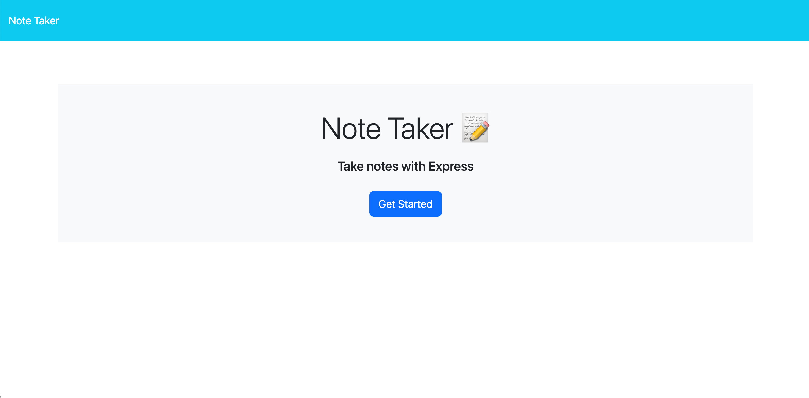
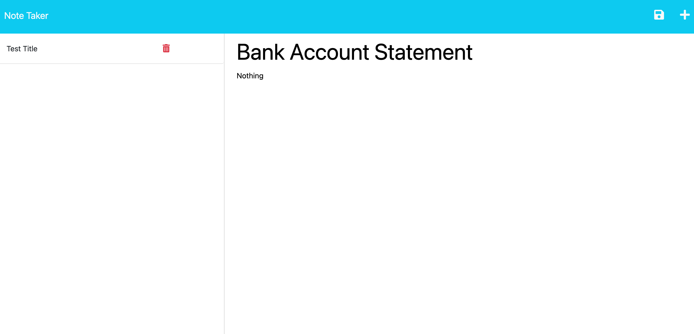
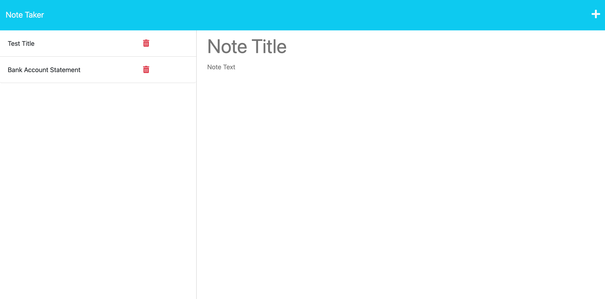

# Note-Taker

## Description
User can write notes save and delete them.  Enter a note title and note body is required for it to be saved.  The list of notes will be shown below on the left side.    When delete button is clicked the page is refreshed and the delete note will be removed.


## Table of Contents
* [Links](#links)

* [Installation](#installation)

* [Usage](#usage)

* [License](#license)

* [Code](#code)

* [Tests](#tests)

* [Questions](#questions)

## Links

Heroku:  https://lit-lake-70648.herokuapp.com/
Github: git@github.com:rypab4/Note-Taker.git 

## Installations 

To install necessary dependencies, run the following command:

```
node.js
npm install
    "express": "^4.16.4",
    "nanoid": "^4.0.0",
    "uuid": "^9.0.0",
    "uuidv4": "^6.2.13"
inquirer
```


## Usage
This tool is able to create notes
1.  Go to https://lit-lake-70648.herokuapp.com/ website and click Get Started.



2.  Type in note title and note body and a disk icon button will appear:



3.  Click on th disk icon and the note will appear to the left:


4.  You can delete the note by clicking on the trash icon.


## License
    
none


## Code
* HTML/CSS
* JS
* Bootstrap
* Node.js
* Jest
* Inquirer
* fs


## Tests
To run tests, run the follwoing command:
```
npm test
```

## Questions
If you have any questions about the repo, open an issue or contact me directly at rypab4@gmail.com.  You can find my work at https://www.github.com/rypab4.

